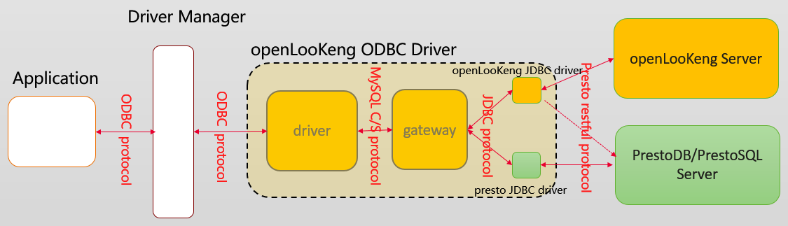

# openLooKeng ODBC Driver

The openLooKeng ODBC Driver provides the ODBC interconnection capability for openLooKeng. In addition, this driver can be connected to other versions (such as prestosql and prestodb) based on presto evolution through configuration, so you can alse use it as a presto odbc driver.

## Introduction

The openLooKeng ODBC Driver is a ODBC-JDBC gateway solution, it consists of two parts: driver and gateway.            

The driver provides the capability of interconnecting with the ODBC protocol, and the gateway provides the capability of interconnecting with openLooKeng server.

The [driver](https://gitee.com/openlookeng/hetu-odbc-driver) is extended based on [mariadb-connector-odbc](https://github.com/mariadb-corporation/mariadb-connector-odbc). 

The [gateway](https://gitee.com/openlookeng/hetu-odbc-gateway) is extended based on [Mycat-Server](https://github.com/MyCATApache/Mycat-Server). 

 

## How to use and start

   see openLookeng [user guide(english)](docs/userguide_en.md)  [user guide(chinese)](docs/userguide_zh.md)          
   see openLookeng [development guide(english)](docs/developerguide_en.md)  [development guide(chinese)](docs/developerguide_zh.md)      